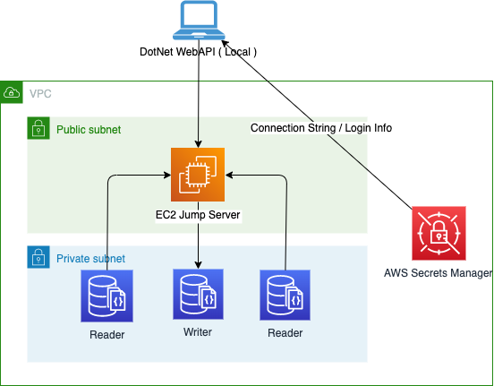

# DotNet / CSharp Starter project for Amazon DocumentDB

## Introduction
Welcome to this MongoDB and ASP.Net Core Web API sample project. 
The aim of this project is to give you a working example of how you can use the power of MongoDB Atlas and .NET to create modern applications.
This project is intended to be a companion project to the article [How to use MongoDB Atlas with .NET/.NET Core](https://www.mongodb.com/languages/how-to-use-mongodb-with-dotnet) from the MongoDB website.

## Requirements 
1. DotNet Core 6.0+
2. Amazon DocumentDB 
3. AWS CLI 2.4+
4. Make commandline tools.  MacOs[https://formulae.brew.sh/formula/make], Windows [https://linuxhint.com/install-use-make-windows/] 


## Getting Started



### Setting up dev

## Data Import 

Use at your own risk; not a supported MongoDB product 

```
mongoimport --file=restaurants.json --db=restaurants --collection=locations
mongoimport --tlsInsecure --ssl --sslCAFile rds-combined-ca-bundle.pem --username docdb --password docdb123 --file=data/restaurant.json --db=restaurants --collection=locations --writeConcern "{w:0}"
```

```
mongosh --tlsAllowInvalidHostnames --tls --tlsCAFile rds-combined-ca-bundle.pem --username docdb --password docdb123
mongosh --tlsAllowInvalidHostnames --tls --tlsCAFile rds-combined-ca-bundle.pem --username docdb --password docdb123

```
### Setup 

```
export ACCOUNT_ID=$(aws sts get-caller-identity --query 'Account' --output text)
export AWS_REGION=$(aws configure get region)

cdk bootstrap aws://$ACCOUNT_ID/$AWS_REGION
```


```
aws ec2 create-key-pair --key-name ec2-keypair --query 'KeyMaterial' --output text > ec2-keypair.pem
chmod 400 ec2-keypair.pem
```